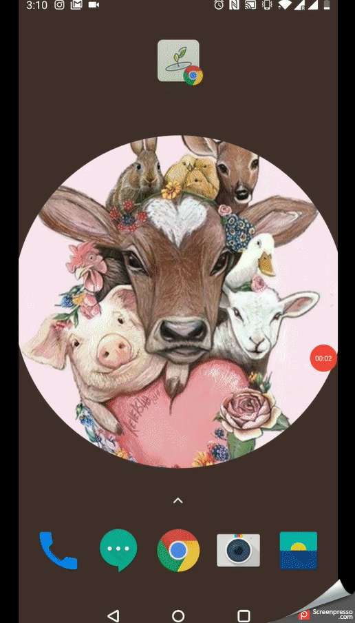
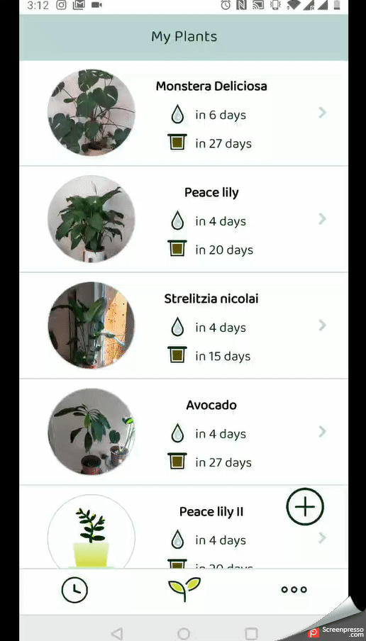

# plantastick
This is a plant tracking app that was created as a final project for the Javascript semester at ReDI School Berlin. 
This project was created by me and my school colleague [Zahra Beigi](https://github.com/z195). This app allows the user to keep track of his plant-care activities. User can create a profile for each of his plants, take a plant photo, set the watering and fertilizing schedule and add some notes. The app is using the local storage to store all the data. The app will remind the user once there is a time to water of fertilize one of his plants. Below you can see the presentation describing our process and some GIFs with the highlights of the app. 

### Project presentation

<object data="appGIFs/Project-presentation.pdf" type="application/pdf" width="700px" height="700px">
    <embed src="appGIFs/Project-presentation.pdf">
        
This browser does not support PDFs. Please download the PDF to view it: <a href="appGIFs/Project-presentation.pdf">Download PDF</a>.

    </embed>
</object>

### User can add his plants 

### User will be notified once he should water of fertilized his plant 

### User can edit his plant parameters and remove unwanted plant-profile

 
